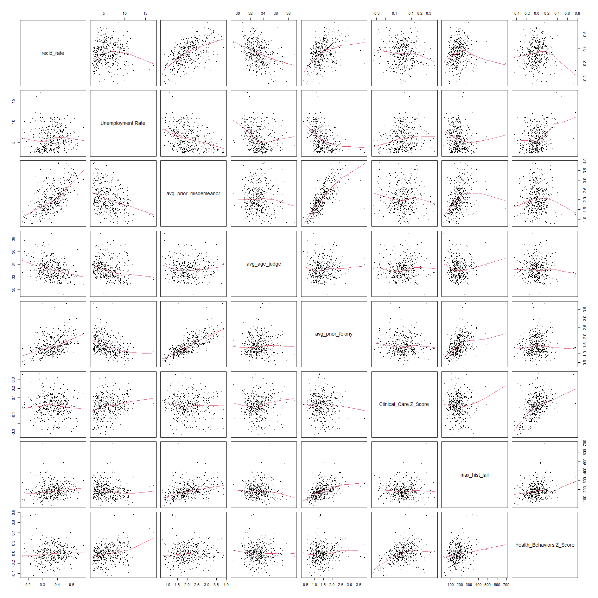
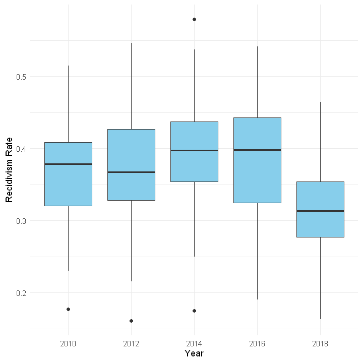
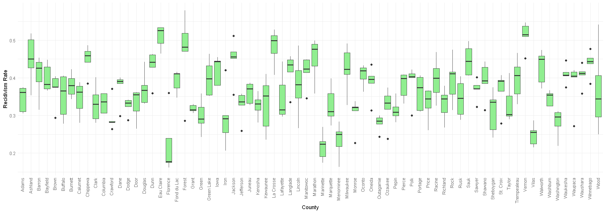

# Predict recidivism rates in Wisconsin counties
This projects models recidivism rate per county using Poisson Regression with an offset.

## Goals
1. Predict recidivism rates across counties in WI.
2. Analyze the effects of individual factors, county unemployment rate, and county health factors to recidivism.
3. Find relevant predictors to an increased risk in recidivating.
4/ Assess model fit and implement diagnostic tests.

## Data Source
1. WCLD: Curated Large Dataset of Criminal Cases from Wisconsin Circuit Courts
- Description: A curated large dataset of 1.5 million criminal cases from circuit courts in the U.S. state of Wisconsin, consisting of data from 1970 to 2020 for every county, to include attributes like prior criminal counts and recidivism outcomes.
- Source: https://clezdata.github.io/wcld/.

2. Job Center of Wisconsin: Labor Market Information
- Description: State of Wisconsin's Department of Workforce Development provides labor market information to be queried from their website where Unemployment data from 1990 to 2025 is available for each each county.
- Source: This data can be queried on https://jobcenterofwisconsin.com/wisconomy/query.

3. University of Wisconsin Population Health Institute: County Health Rankings & Roadmaps
- Description: Based from the University of Wisconsin Population Health Institute Model of Health where collective health and well-being from 2010 to 2025 is summarized as a score based from multiple weighted factors captured within two focus areas: 1) Population Health and Well-being, and 2) Community Conditions.
- Source: Information on the factors comprising focus areas can be found on https://www.countyhealthrankings.org/what-impacts-health/model-of-health and the data can be downloaded on https://www.countyhealthrankings.org/health-data/wisconsin/data-and-resources.

## Exploratory Data Analysis

### Pairs Plot

### Year vs Recidivism Rate

### County vs Recidivism Rate

